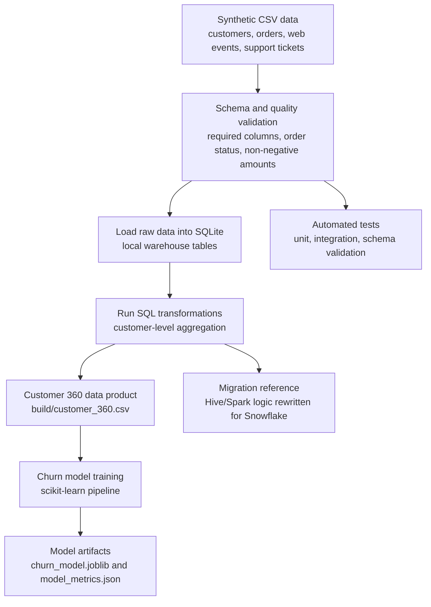

# Customer 360 Data Engineering Demo

This is a small, runnable data engineering portfolio project that shows how raw customer data can be validated, transformed, aggregated, and prepared for machine learning. The project simulates a retail Customer 360 use case where customer identity, orders, website activity, and support tickets are combined into one analytics-ready data product.

The goal is not to build a large production platform. The goal is to demonstrate practical data engineering fundamentals in a project that a reviewer can clone, run, test, and understand quickly.

## Data Source

The data in `data/raw/` is synthetic sample data created by ChatGPT for this portfolio project. It is not copied from a real company, public dataset, customer system, or Kaggle dataset.

The sample data was designed to look like realistic retail source-system extracts:

- `customers.csv`: customer profile and acquisition data
- `orders.csv`: order history with completed and returned orders
- `web_events.csv`: website behavior and checkout events
- `support_tickets.csv`: customer support case history

Because the data is synthetic, the project is safe to publish on GitHub and does not contain personal, confidential, or production information.

## Data Introduction

The raw data represents four common source systems in a retail business. Each file is intentionally small so the full pipeline can be reviewed quickly.

### `customers.csv`

Customer profile data used as the base table for the Customer 360 product.

| Column | Type | Description |
| --- | --- | --- |
| `customer_id` | String | Unique customer identifier, for example `C001` |
| `first_name` | String | Synthetic customer first name |
| `last_name` | String | Synthetic customer last name |
| `email` | String | Synthetic customer email address |
| `signup_date` | Date | Date when the customer joined |
| `signup_channel` | String | Acquisition channel such as `organic`, `referral`, or `paid_search` |
| `loyalty_tier` | String | Customer loyalty segment: `bronze`, `silver`, or `gold` |
| `country` | String | Two-letter country code |

### `orders.csv`

Order transaction data used to calculate revenue, order count, return count, and latest order activity.

| Column | Type | Description |
| --- | --- | --- |
| `order_id` | String | Unique order identifier |
| `customer_id` | String | Customer linked to the order |
| `order_date` | Date | Date when the order was placed |
| `order_amount` | Decimal | Order value |
| `status` | String | Order status: `completed` or `returned` |

### `web_events.csv`

Website activity data used to understand engagement and checkout behavior.

| Column | Type | Description |
| --- | --- | --- |
| `event_id` | String | Unique event identifier |
| `customer_id` | String | Customer linked to the event |
| `event_time` | Timestamp | Time when the web event happened |
| `event_type` | String | Event type such as `product_view`, `search`, `add_to_cart`, or `checkout` |
| `session_id` | String | Website session identifier |

### `support_tickets.csv`

Customer service data used to measure support volume, resolution time, and high-priority issues.

| Column | Type | Description |
| --- | --- | --- |
| `ticket_id` | String | Unique support ticket identifier |
| `customer_id` | String | Customer linked to the support ticket |
| `created_at` | Date | Date when the ticket was opened |
| `category` | String | Support category such as `billing`, `delivery`, `return`, or `product` |
| `priority` | String | Ticket priority: `low`, `medium`, or `high` |
| `resolved_hours` | Integer | Number of hours needed to resolve the ticket |

## What This Project Does

The pipeline builds a local Customer 360 data product from the synthetic raw datasets. It:

1. Reads CSV source files from `data/raw/`.
2. Validates required schemas and basic data quality rules.
3. Loads the data into a local SQLite warehouse.
4. Runs SQL transformations to aggregate customer-level features.
5. Exports `customer_360.csv` with one row per customer.
6. Trains a simple churn model using the Customer 360 output.
7. Includes Snowflake-style SQL showing how a legacy Hive/Spark dataset could be migrated.

## Workflow



## Problem Set

A retail business has customer, order, web event, and support-ticket data spread across different systems. The analytics team needs a reliable Customer 360 table that can answer:

- Which customers are most valuable?
- Which customers are at risk of churn?
- Which source records are invalid before they enter the data product?
- How would a legacy Hive/Spark table be migrated into a Snowflake model?

## Expected Outcome

The pipeline builds `customer_360` with one row per customer, including revenue, order frequency, web activity, support activity, and churn labels. It also trains a simple churn model locally using the same script shape that can be used as an AWS SageMaker training entrypoint.

Generated outputs:

- `build/customer360.db`: SQLite warehouse with raw, staging, and mart tables
- `build/customer_360.csv`: Customer 360 data product
- `build/model_metrics.json`: churn-model metrics
- `build/churn_model.joblib`: trained scikit-learn model

## Findings From This Demo

After running the pipeline on the synthetic sample data, the generated Customer 360 output contains 6 customers.

Key findings:

- Highest revenue customer: `C005` with `334.99` total revenue.
- Customers flagged as churn risk: `C003` and `C006`.
- Churn-risk pattern in this demo: customers with only 1 completed order, no checkout events, and a high-priority support ticket are marked as churn risk.
- Returned orders are excluded from revenue. For example, customer `C003` had a returned order of `210.00`, so only the completed order of `33.75` is counted in total revenue.
- Gold loyalty customers, `C001` and `C005`, generated the strongest revenue in this sample.
- The model workflow writes `churn_model.joblib` and `model_metrics.json`. The reported metrics are only a technical workflow check because the dataset is intentionally tiny and synthetic.

## Stack Demonstrated

- Python: maintainable package structure, reusable classes, clean CLI
- SQL: staging, aggregation, and mart logic
- Pandas / NumPy: data ingestion and feature preparation
- SQLite locally, with Snowflake-flavored migration SQL included
- pytest: unit, integration, and schema validation tests
- ML workflow: SageMaker-style training script and model artifact output

## Project Structure

```text
customer360-data-engineering-demo/
  data/raw/                  # realistic sample source data
  docs/problem_set.md         # business questions and expected outcomes
  sql/                        # warehouse transformations and migration SQL
  src/customer360/            # pipeline, validation, and ML code
  tests/                      # unit and integration tests
```

## Quick Start

```powershell
cd customer360-data-engineering-demo
python -m venv .venv
.\.venv\Scripts\Activate.ps1
pip install -r requirements.txt
python -m customer360.cli build --data-dir data/raw --output-dir build
python -m customer360.ml.train --input build/customer_360.csv --model-dir build
pytest
```

On macOS/Linux, use `source .venv/bin/activate`.

## Role Mapping

- Customer 360 pipeline: `src/customer360/pipeline.py`, `sql/customer_360.sql`
- ML workflow automation: `src/customer360/ml/train.py`
- Hive/Spark to Snowflake migration: `sql/legacy_hive_to_snowflake.sql`
- Clean Python and SQL: typed functions, small modules, clear boundaries
- Testing and validation: `tests/`, `src/customer360/validation.py`

## Example CLI

```powershell
python -m customer360.cli build --data-dir data/raw --output-dir build
python -m customer360.cli validate --customer360 build/customer_360.csv
```

## Notes

This project intentionally avoids requiring AWS or Snowflake credentials. The code is local-first so a reviewer can run it quickly, while the folder names, scripts, and SQL mirror how the same work would be packaged for production cloud workflows.
