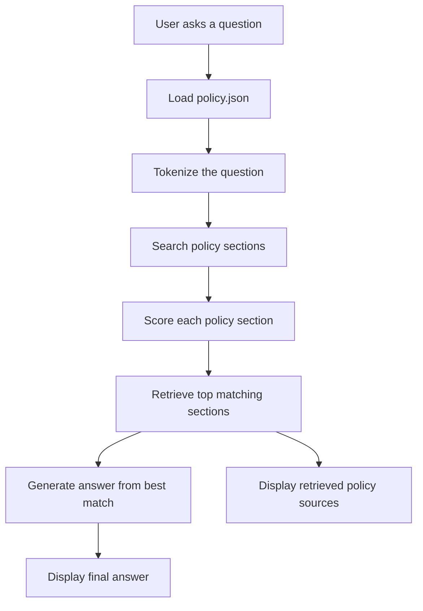
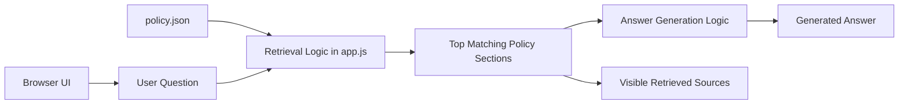

# Simple RAG Application

## Project Overview

This project is a simple Retrieval Augmented Generation application for a fictional grocery delivery company called GreenCart.
The app answers customer support questions by retrieving relevant information from a separate policy file named `policy.json`, then generating a grounded answer from the retrieved policy sections.

The main aim of this project is to understand how RAG works, how it can be implemented, and what process happens behind the scenes when a question is answered.

## Important Note About The Policy File

The policy file used in this demo, `policy.json`, was generated by ChatGPT for educational and demonstration purposes.
It does not represent a real company policy.

The file is used as the knowledge source for the RAG application.
When the user asks a question, the app searches this file first and then generates an answer from the matching policy sections.

## Why This Was Built

This project was built to understand the complete RAG workflow in a simple way.
Instead of only reading about RAG theory, this demo shows the actual process:

1. A user asks a question.
2. The app retrieves relevant data from a knowledge source.
3. The retrieved data is used as context.
4. The app generates an answer from that context.
5. The source sections are displayed so the user can see where the answer came from.

The project also solves a realistic customer support scenario where agents need quick and policy-based answers.

## Purpose

The purpose of this project is to:

1. Understand what RAG is.
2. Understand how retrieval works.
3. Understand how retrieved context is used to generate an answer.
4. Show clearly where the answer is coming from.
5. Build a small but working RAG-style application without external APIs.
6. Create a portfolio-friendly AI project that explains both implementation and outcome.

## Use Case

The use case is a customer support assistant for GreenCart, a fictional grocery delivery company.

A customer can ask questions such as:

1. Can I get a refund if my groceries arrive late?
2. Do you deliver frozen food safely?
3. How can I change my delivery address?
4. How long does a refund take?
5. What happens if the driver cannot reach me?
6. Can I return non-food items?
7. What should I do if my account was accessed by someone else?

The app is not limited to only three fixed questions.
The user can ask any question related to the content inside `policy.json`.

## Problem Statement

Customer support teams often answer repeated questions about delivery, refunds, missing items, account issues, payments, cancellations, and food safety.
If support agents manually search policy documents, the response can be slow or inconsistent.

The problem this project explores is:

> How can an assistant answer customer questions quickly while showing exactly which policy information was used?

## Solution

The solution is a simple RAG workflow:

1. Store support policies in `policy.json`.
2. Accept a user question from the browser interface.
3. Search the policy file for the most relevant sections.
4. Select the top matching policy sections as retrieved context.
5. Generate an answer from the best matching section.
6. Display the retrieved policy sections beside the answer.

## Where The Answer Comes From

The answer comes from:

```text
rag-demo/policy.json
```

This file contains fictional GreenCart policy sections.
Each section has:

1. An ID.
2. A category.
3. A title.
4. Policy content.
5. A prepared answer based on that policy content.

The JavaScript file `app.js` loads `policy.json`, searches it, and uses the best matching policy section to produce the final answer.

## How RAG Works In This Project

This project uses a simplified RAG pipeline:

1. The user enters a question.
2. The app loads policies from `policy.json`.
3. The question is tokenized into searchable words.
4. Each policy section is also tokenized.
5. The app compares the question words with each policy section.
6. Each section receives a match score.
7. The highest scoring sections are retrieved.
8. The best matching section is used to generate the answer.
9. The retrieved sections are shown as sources.

## Flowchart



## Architecture



## Tech Stack

| Area | Technology |
| --- | --- |
| Frontend | HTML |
| Styling | CSS |
| Logic | JavaScript |
| Knowledge Source | `policy.json` |
| Policy Data | ChatGPT-generated fictional policy content |
| Retrieval Method | Tokenization and term-overlap scoring |
| Runtime | Browser through local server |
| External AI API | None |
| Vector Database | None |

## Main Files

| File | Purpose |
| --- | --- |
| `index.html` | Page structure and user interface |
| `styles.css` | Visual styling |
| `app.js` | Loads the policy file, retrieves relevant sections, and generates answers |
| `policy.json` | ChatGPT-generated fictional policy file used as the knowledge source |
| `README.md` | Explains the project, purpose, flow, outcome, and implementation |

## Key Features

1. Uses a separate policy file as the retrieval source.
2. Lets users ask custom questions, not only fixed examples.
3. Retrieves top matching policy sections.
4. Shows match scores for retrieved sections.
5. Displays the exact policy context used for the answer.
6. Generates an answer from retrieved policy content.
7. Runs without paid APIs or external AI services.
8. Demonstrates the process behind a RAG application clearly.

## Outcome

The final outcome is a working educational RAG demo.
It shows that a RAG system does not simply answer from memory.
Instead, it first searches a knowledge source, retrieves useful context, and then answers based on that context.

Expected learning outcomes:

1. Understand the difference between normal chatbot answers and RAG-based answers.
2. Understand why a knowledge source is needed.
3. Understand how retrieval selects relevant information.
4. Understand why showing sources improves trust.
5. Understand the basic implementation flow of a RAG application.

## Example Output

Question:

```text
How long does a refund take?
```

Retrieved source:

```text
Refund processing time
Source: policy.json
```

Generated answer:

```text
GreenCart submits approved refunds immediately, but banks and card providers usually take
3 to 7 business days to return the money to your account.
```

## Limitations

This is a simplified learning project.
It does not include:

1. Real LLM-generated text.
2. Vector embeddings.
3. A vector database.
4. Semantic search.
5. Real company policies.
6. Real document upload.
7. User authentication.
8. Production monitoring.

The current answer generation is rule-based and uses prepared answer text from the retrieved policy section.
This keeps the project simple and focused on understanding the RAG process.

## Possible Future Improvements

1. Replace keyword matching with embeddings.
2. Store policy chunks in a vector database such as Chroma, FAISS, Pinecone, or Weaviate.
3. Connect the retrieved context to an LLM API.
4. Generate natural language answers dynamically from retrieved context.
5. Add PDF upload and automatic document chunking.
6. Add citations with exact source locations.
7. Add feedback buttons for answer quality.
8. Add an admin page for managing the policy file.

## How To Run

Because the app loads `policy.json` with JavaScript, run it through a local web server.

From the `rag-demo` folder:

```bash
python -m http.server 8765
```

Then open:

```text
http://127.0.0.1:8765
```

If you serve the parent folder instead, open:

```text
http://127.0.0.1:8765/rag-demo/
```

## Project Summary

This project demonstrates the basic RAG idea:

> Retrieve relevant information first, then answer using that retrieved information.

The project was intentionally kept simple so the focus stays on understanding RAG, its implementation, and the process behind it.
